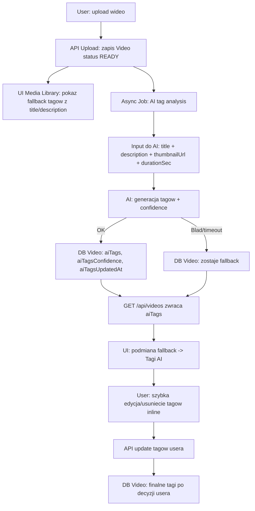
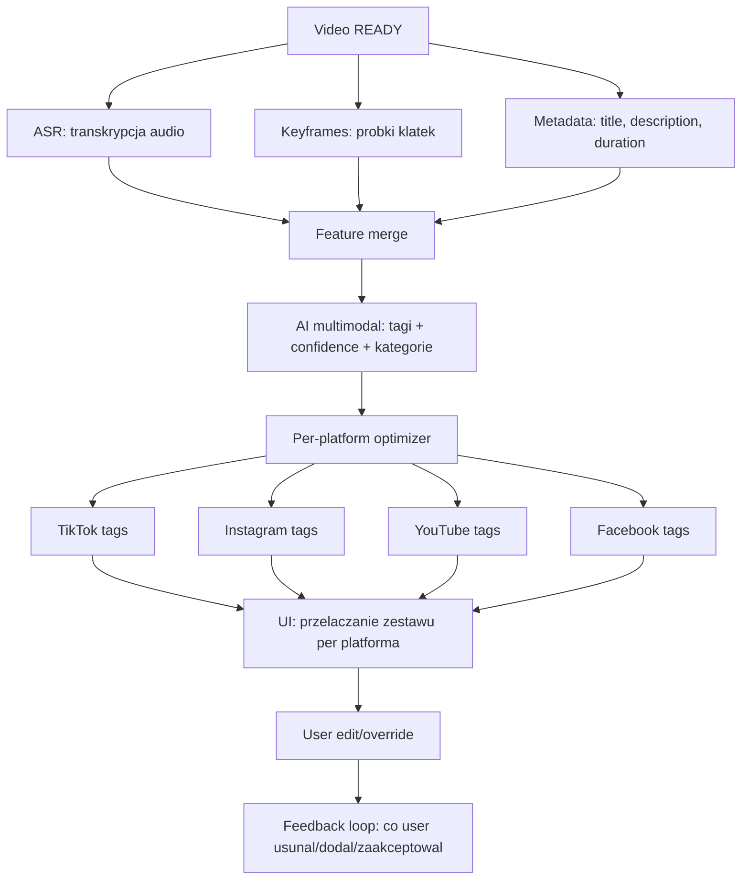

# Plan wdrozenia AI tagow dla Media Library

## Cel
Podniesc jakosc tagow w bibliotece mediow i skrocic czas potrzebny userowi na przygotowanie publikacji.

Plan realizuje trzy zalozenia:
1. Wdrozyc MVP hybrydowe teraz.
2. Dodac transkrypcje i per-platform tag optimization w drugim kroku.
3. Zostawic uzytkownikowi mozliwosc szybkiej edycji/usuniecia tagow.

## Zakres i podejscie
- Podejscie hybrydowe: natychmiastowy fallback tagow + asynchroniczna analiza AI.
- Brak blokowania usera po uploadzie.
- Tagi AI sa sugestia, user zawsze ma ostatnie slowo.

## Dostosowanie do subskrypcji (analiza)

### Co jest juz w billing
- Limity planow sa zdefiniowane centralnie (`PLAN_LIMITS`) i egzekwowane przez backend usage counters.
- Aktualnie macie metryki: `video_uploads`, `publish_jobs`, `ai_autopilot_runs`.
- Trial nowych kont podnosi efektywny plan z `FREE` do `PRO` (czasowo), co wplywa na limity.

### Wplyw na AI tagi
- Fallback tagow (z title/description) powinien byc dostepny zawsze, dla wszystkich planow, bez limitu.
- Analiza AI tagow powinna byc limitowana planowo, bo generuje koszt.
- Reczne odswiezenie tagow i automatyczne przetworzenie po uploadzie powinny konsumowac te sama metryke usage.

### Rekomendowana polityka planowa dla AI tagow
1. Free:
  - AI tagi: wlaczone z niskim limitem miesiecznym.
  - Propozycja: 10 analiz/miesiac.
2. Starter:
  - AI tagi: wlaczone ze srednim limitem.
  - Propozycja: 50 analiz/miesiac.
3. Pro:
  - AI tagi: wysoki limit.
  - Propozycja: 300 analiz/miesiac.
4. Business:
  - AI tagi: bez limitu.

### Dlaczego tak
- Nie laczyc AI tagow z `ai_autopilot_runs`, bo to inny typ wartosci biznesowej i inny koszt.
- Nie laczyc AI tagow z `video_uploads`, bo user moze chciec ponownej analizy tego samego materialu.
- Osobna metryka daje czysta komunikacje i czytelny upsell.

### Niezbedne zmiany backend
1. Dodac nowa metryke usage: `ai_tag_generations`.
2. Dodac limity `ai_tag_generations` do planow i snapshotu subskrypcji.
3. Przed uruchomieniem AI analizy tagow: `assertUsageAllowed(userId, 'ai_tag_generations')`.
4. Po sukcesie analizy: `incrementUsage(userId, 'ai_tag_generations')`.
5. Gdy limit przekroczony:
  - zapis fallback,
  - status "AI niedostepne w tym okresie",
  - brak blokady uploadu/listy.

### Niezbedne zmiany frontend
1. Pokazywac licznik wykorzystania AI tagow (np. `wykorzystano X/Y`).
2. Przycisk "Odswiez tagi AI":
  - aktywny tylko gdy limit > 0 i sa dostepne kredyty.
  - po limicie: disabled + jasny komunikat i CTA do planu wyzej.
3. Gdy AI niedostepne:
  - fallback tagi nadal widoczne,
  - user nadal moze edytowac/usuwac tagi.

### Edge cases i zasady
1. Trial aktywny: traktowac usera jak `PRO` dla AI tagow.
2. Retry po bledzie technicznym nie powinien spalac limitu, jesli analiza nie zwrocila wyniku.
3. Re-analiza tego samego wideo po zmianie modelu:
  - spalac limit tylko przy manualnym `refresh` lub zaplanowanym reprocess jobie.
4. Cache wynikow:
  - jesli wynik AI istnieje i jest swiezy, nie odpalac analizy ponownie.

### Wdrozenie subskrypcji: konkretne taski techniczne

#### Backend i billing
1. Rozszerzyc typ `UsageMetric` o `ai_tag_generations`.
2. Rozszerzyc `PLAN_LIMITS` o `ai_tag_generations` dla wszystkich planow.
3. Rozszerzyc snapshot subskrypcji (`/api/billing/subscription`) o usage tej metryki.
4. Dodac capability do payloadu billing capabilities (do wyswietlania limitu AI tagow w UI).
5. Dodac helper `assertAiTagsUsageAllowed(userId)` (wrapper na `assertUsageAllowed`).
6. Dodac increment tylko po sukcesie zapisu wyniku AI (nie przy timeout/error).

#### API tagow AI
1. Endpoint refresh tagow ma:
  - sprawdzac limit,
  - uruchamiac analize,
  - inkrementowac usage po sukcesie,
  - zwracac jasny kod bledu przy limicie (np. `AI_TAGS_LIMIT_REACHED`).
2. Endpoint listy wideo ma zwracac:
  - `aiTags`,
  - `aiTagsConfidence`,
  - `aiTagsUpdatedAt`,
  - `aiTagsSource`,
  - opcjonalnie `aiTagsStatus` (`ready` / `fallback` / `unavailable_limit`).

#### Frontend
1. W Media Library pokazac licznik AI tagow z subskrypcji: `wykorzystano X/Y`.
2. Przycisk "Odswiez tagi AI":
  - disabled przy limicie,
  - tooltip/komunikat z przyczyna,
  - CTA do `/billing`.
3. Gdy limit przekroczony:
  - pokazac fallback + status "AI niedostepne w tym okresie".
4. Przy aktywnym trialu PRO pokazywac limity zgodne z efektywnym planem.

#### Telemetria i monitoring
1. Event: `ai-tags-requested`.
2. Event: `ai-tags-generated` (z confidence, source, duration).
3. Event: `ai-tags-limit-reached` (plan, usage, limit).
4. Dashboard: skutecznosc analizy i % fallback z powodu limitu.

#### Definicja done dla subskrypcji
1. Free/Starter/Pro/Business maja rozne limity AI tagow i sa egzekwowane backendowo.
2. UI zawsze pokazuje userowi aktualny stan limitu AI tagow.
3. Po przekroczeniu limitu AI nie blokuje pracy: fallback i edycja reczna dalej dzialaja.
4. Trial daje zachowanie zgodne z efektywnym planem (PRO), bez rozjazdu frontend/backend.

## Wizualizacja przeplywu danych

### MVP (Etap 1)

### Etap 2 (transkrypcja + per-platform)

### Co user widzi w praktyce
1. Po uploadzie od razu widzi fallback tagi.
2. Po chwili fallback jest podmieniany na Tagi AI (jesli analiza sie powiedzie).
3. User moze natychmiast edytowac/usuwac tagi bez zmiany widoku.
4. Awaria AI nie blokuje biblioteki i nie przerywa flow.

---

## Etap 1: MVP hybrydowe (wdrozyc teraz)

### 1. Dane i model
- Dodac do modelu `Video` pola:
  - `aiTags String[] @default([])`
  - `aiTagsSource String?` (np. `fallback` / `vision-lite`)
  - `aiTagsConfidence Float?`
  - `aiTagsUpdatedAt DateTime?`
- Dodac migracje Prisma.

### 2. Generowanie tagow
- Zachowac obecny fallback oparty o tytul/opis jako warstwa natychmiastowa.
- Dodac asynchroniczny job po uploadzie i statusie `READY`:
  - Input: `title`, `description`, `thumbnailUrl`, `durationSec`.
  - Output: 5-8 tagow + confidence.
- Jesli AI zawiedzie lub timeout:
  - zapisac fallback i nie przerywac flow usera.

### 3. API
- Rozszerzyc `GET /api/videos` o pola `aiTags`, `aiTagsConfidence`, `aiTagsUpdatedAt`.
- Dodac endpoint do recznego odswiezenia tagow dla pojedynczego wideo:
  - `POST /api/videos/:id/ai-tags:refresh`.

### 4. UI (Media Library)
- W widoku listy:
  - wyswietlac `aiTags` jesli sa gotowe,
  - fallback tylko gdy `aiTags` puste,
  - badge "Tagi AI" + opcjonalnie confidence.
- Dodac szybkie akcje przy materiale:
  - "Edytuj tagi" (inline chips input),
  - "Usun tag",
  - "Odswiez tagi AI".
- Zmiany usera zapisywac od razu (optimistic UI + rollback on error).

### 5. Bezpieczenstwo i jakosc
- Ograniczyc tagi do whitelisty znakow (`#` + litery/cyfry/_), max dlugosc np. 32.
- Deduplikacja i normalizacja (lowercase, bez duplikatow semantycznych).
- Limit liczby tagow (np. 8).

### 6. Kryteria odbioru MVP
- Po uploadzie user widzi tagi od razu (fallback), a po chwili podmiane na tagi AI.
- User moze edytowac i usuwac tagi bez przechodzenia do innego widoku.
- Awaria AI nie blokuje uploadu i listy mediow.
- TTFB listy mediow bez istotnego regresu.

---

## Etap 2: Transkrypcja + per-platform tag optimization

### 1. Transkrypcja
- Dodac pipeline ASR dla materialow video:
  - ekstrakcja audio,
  - transkrypcja,
  - zapis skrotu/transcript snippet.
- Uzywac transkrypcji jako glownego sygnalu semantycznego dla tagow.

### 2. Analiza multimodalna
- Dodac keyframe sampling (np. 3-8 klatek) dla lepszej klasyfikacji wizualnej.
- Laczyc sygnaly: title + description + transcript + keyframes + metadata.

### 3. Per-platform optimization
- Generowac zestawy tagow per platforma:
  - TikTok: krotsze, trendowe,
  - Instagram: discovery + nisza,
  - YouTube: intencja wyszukiwania,
  - Facebook: szersze, lokalne konteksty.
- Dodac mozliwosc przelaczania podgladu tagow per platforma.

### 4. Ranking i feedback loop
- Ranking tagow po skutecznosci historycznej (CTR/ER/watch-time, jesli dostepne).
- Uczenie na zachowaniach usera:
  - ktore tagi usuwa,
  - ktore recznie dodaje,
  - ktore publikuje bez zmian.

### 5. Kryteria odbioru Etapu 2
- Tagi AI po transkrypcji sa istotnie bardziej trafne niz fallback.
- User moze wybrac gotowy zestaw per platforma 1 kliknieciem.
- Mozliwy reczny override i zapis preferencji.

---

## UX: szybka edycja/usuwanie tagow (wymaganie stale)
- Kazdy tag jako chip z ikona usuniecia.
- Inline input do dodania nowego tagu Enterem.
- Skróty:
  - Backspace na pustym polu usuwa ostatni tag,
  - Esc zamyka edycje.
- Walidacja inline i czytelny blad (np. "Tag za dlugi", "Niedozwolone znaki").
- Przyciski:
  - "Cofnij" (ostatnia zmiana),
  - "Przywroc tagi AI".

---

## Plan realizacji (sprintowo)

### Sprint 1 (MVP)
- Migracja modelu `Video`.
- Serwis generacji tagow (fallback + AI async).
- API read/write tagow i refresh.
- UI listy + szybka edycja/usuwanie.
- Telemetria i logi bledow.

### Sprint 2
- Stabilizacja, poprawa copy i walidacji.
- A/B porownanie fallback vs AI (jakosc i czas do publikacji).

### Sprint 3 (Etap 2)
- Transkrypcja i keyframes.
- Per-platform optimization.
- Ranking i feedback loop.

---

## Metryki sukcesu
- % materialow, dla ktorych user akceptuje tagi AI bez zmian.
- Srednia liczba manualnych edycji tagow na material.
- Czas od uploadu do gotowosci tagow AI.
- Wplyw na skutecznosc publikacji (proxy: CTR/ER/watch-time gdzie dostepne).

## Ryzyka i mitigacje
- Koszt AI: limity planowe, cache wynikow, retry z backoff.
- Opoznienia: fallback natychmiast + async update.
- Niska trafnosc: confidence threshold + "Przywroc fallback".
- Prywatnosc: analiza tylko na potrzeby sugestii tagow, bez ekspozycji surowych danych.

---

## Tabela planowania AI (feature -> endpoint -> usage -> limity -> UI)

| Feature AI | Endpoint/API | Metryka usage | Limity planow (propozycja) | Copy i zachowanie UI |
|---|---|---|---|---|
| AI tagi dla Media Library (auto + refresh) | `POST /api/videos/:id/ai-tags:refresh`, async po `READY`, read przez `GET /api/videos` | `ai_tag_generations` | Free: 10/mies., Starter: 50/mies., Pro: 300/mies., Business: bez limitu | Pokaz `Wykorzystano X/Y`. Po limicie: `AI niedostepne w tym okresie` + CTA `Zmien plan`. Fallback zawsze widoczny. |
| AI quality check przed publikacja | `POST /api/publish-jobs/enqueue` (pre-check) | `ai_quality_checks` | Free: 20/mies., Starter: 100/mies., Pro: 500/mies., Business: bez limitu | Badge `Sprawdzono przez AI`. Po limicie: `Publikujesz bez sprawdzenia AI`. Brak blokady publikacji. |
| AI naprawa bledow publikacji (guided fix) | nowy `POST /api/publish-jobs/:id/ai-fix` | `ai_fix_suggestions` | Free: 5/mies., Starter: 30/mies., Pro: 200/mies., Business: bez limitu | Przycisk `Podpowiedz naprawe`. Po limicie: disabled + komunikat + link do `/billing`. |
| AI best-time recommendation (personalizowane sloty) | rozszerzenie `POST /api/jobs/ai-schedule` | `ai_schedule_optimizations` | Free: 10/mies., Starter: 40/mies., Pro: 200/mies., Business: bez limitu | `Sugestie czasu publikacji`. Po limicie: fallback na reguly bazowe. |
| AI planner kampanii z celu biznesowego | rozszerzenie `POST /api/campaigns/weekly-plan` | `ai_campaign_plans` | Free: 4/mies., Starter: 20/mies., Pro: 100/mies., Business: bez limitu | `Zaproponuj plan AI`. Po limicie: planner reczny dalej dziala. |

### Zasady wspolne dla wszystkich AI featureow
1. Fallback manualny lub heurystyczny zawsze dziala, niezaleznie od limitu AI.
2. Limit inkrementujemy tylko przy sukcesie operacji AI (nie przy timeout/error).
3. Trial traktujemy zgodnie z efektywnym planem (np. PRO).
4. Komunikaty o limicie musza byc spójne: ten sam wzorzec copy i CTA do `/billing`.
5. W snapshot subskrypcji pokazujemy usage i limit dla kazdej metryki AI.
